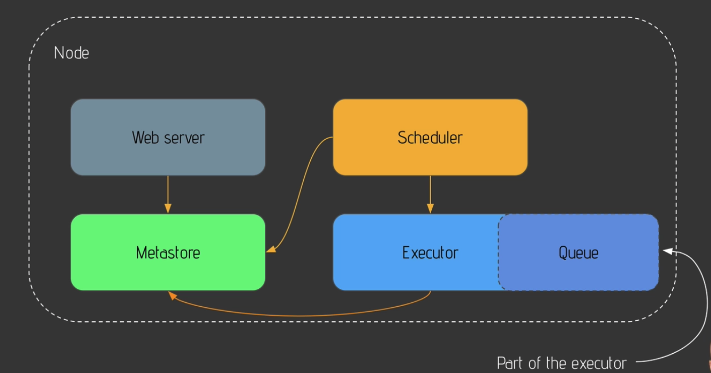

## Why Airflow
Typical Usecase: data pipeline to trigger ever day of 10PM
- Downloading Data(Request API) -> Processing Data(Spark) -> Storing Data(Intsert/Update database)

## What is Airflow
Apache Airflow is an ope source platform to programmatically author, schedule, and monitor workflows

Benefits: dynamic, scalability, ui, extensibility(if you want to integrate airflow with a new tool, you dont need to wait until airflow upgrade, you can create the plugin added to your app)

Key componenets:
- Web server: flask server with Gunicorn serving the UI
- Scheduler: daemon in charge of scheduling workflows
- Metastore: database where metadata are stored
- Executor: claass defining how your tasks should be executed
- Worker: process/subprocess executing your task

DAG: no loop!
- The work (tasks), and the order in which work should take place (dependencies), written in Python.

Operator
- Operators are the main building blocks of Airflow DAGs. They are classes that encapsulate logic to do a unit of work. 
- When you create an instance of an operator in a DAG and provide it with it's required parameters, it becomes a task. Many tasks can be added to a DAG along with their dependencies.
- Like: action operator, transfer operator, sensor operator

Task/Task Instance
- Task: Defines work by implementing an operator, written in Python.
- Task Instance: An instance of a task - that has been assigned to a DAG and has a state associated with a specific DAG run (i.e for a specific execution_date).

Workflow: a dialogue with operators, with tasks, with dependencies

Airflow is not a data streaming solution neither a data processing framework

## How Airflow works
One node architecture

Multi nodes architecture

