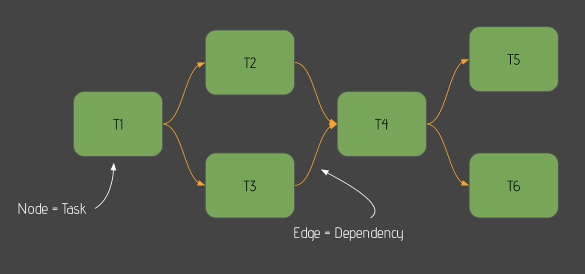
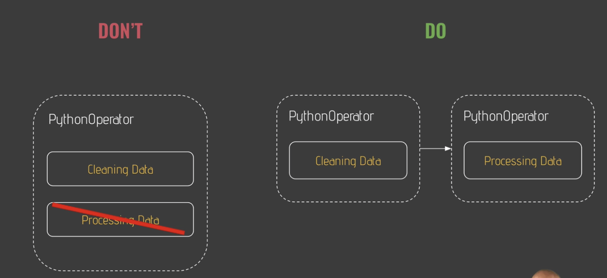
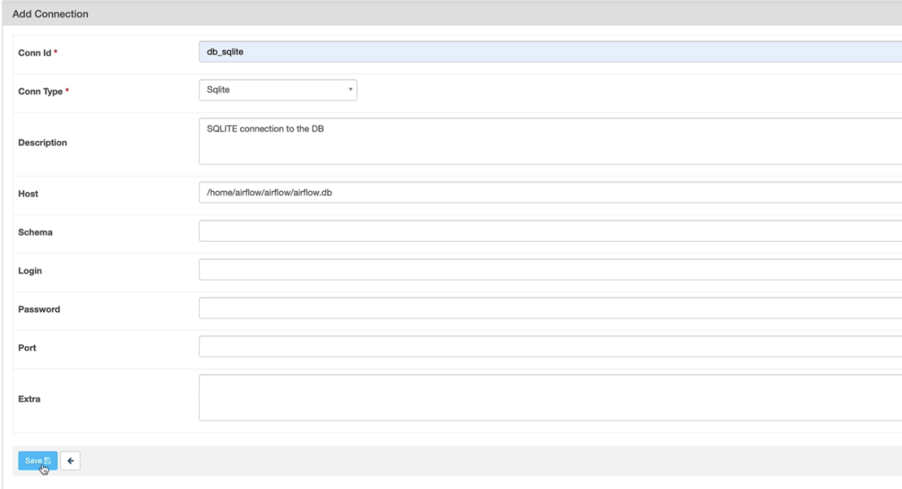
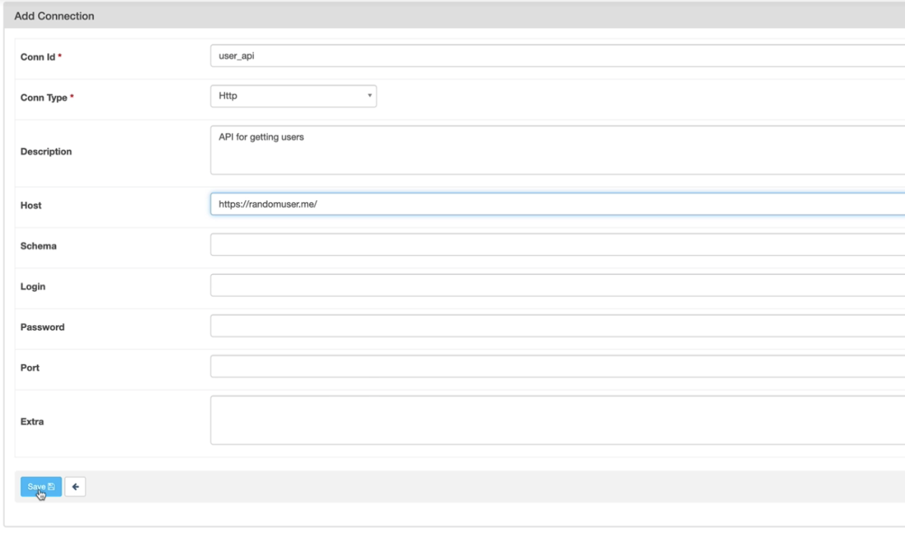
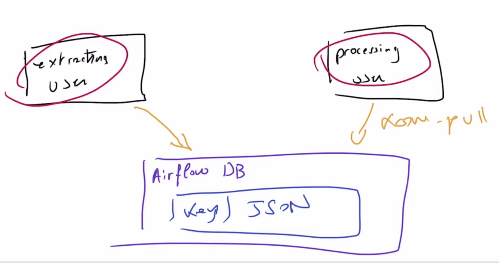

## What's DAG


## Time to code first DAG
create_table -> is_api_available -> extract_user -> process_user->store_user

## DAG Skeleton
Go to virtual machine(vs code ssh into, remember open airflow vm on background) -> create dags folder -> create user_processing.py

```python
from airflow.models import DAG
from datetime import datetime

default_args = {
  'start_date': datetime(2020,1,1)
}
with DAG('user_processing', 
          schedule_interval='@daily',
          default_args=default_args,
          catchup=False) as dag:
  # define tasks/operators
```

## What is an Operator
Operator defines **one task** in your data pipeline. Don't put two tasks in one operator



- action operators: execute an action
- transfer operator: transfer data
- sensor: wait for a condition to be met

## Create Table
```python
from airflow.models import DAG
from airflow.providers.sqlite.operators.sqlite import SqliteOperator
from datetime import datetime

default_args = {
  'start_date': datetime(2020,1,1)
}
with DAG('user_processing', 
          schedule_interval='@daily',
          default_args=default_args,
          catchup=False) as dag:
  creating_table = SqliteOperator(
    task_id='creating_table',
    sql_conn_id='db_sqlite',
    sql='''
      CREATE TABLE users(
        firstname TEXT NOT NULL,
        lastname TEXT NOT NULL,
        country TEXT NOT NULL, 
        username TEXT NOT NULL,
        password TEXT NOT NULL,
        email TEXT NOT NULL PRIMARY KEY,
      );
    '''
  )
```

```console
cd ~
source sandbox/bin/activate
airflow webserver
airflow scheduler
```

```console
cd ~
source sandbox/bin/activate
airflow webserver
pip install `apache-airflow-providers-sqlite`
```

set up connection



## Test task in cli
```console
airflow task test user_preocessing creating_table 2020-01-01

sqlite3 airflow.db
.tables
```

## Providers
Airflow 2.0 is composed of multiple separated but connected packages with a Core package apache-airflow and providers.

A provider is an independent python package that brings everything your need to interact with a service or a tool such as Spark or AWS.

It contains connection types, operators, hooks and so on.

By default, some operators are pre installed by default such as the PythonOperator and the BashOperator but for the others you will have to install the corresponding prodiver.

Now, you can install only the operators you need (no more 200 different dependencies to deal with whereas you just use 3 or 4 operators). If there is a new version of your operator, you just have to update the provider and not your Airflow instance like before. On top of that, it's never been easy to create your own provider.


## Is API available?
```python
from airflow.models import DAG
from airflow.providers.sqlite.operators.sqlite import SqliteOperator
from airflow.providers.http.sensors.http import HttpSensor
from datetime import datetime

default_args = {
  'start_date': datetime(2020,1,1)
}
with DAG('user_processing', 
          schedule_interval='@daily',
          default_args=default_args,
          catchup=False) as dag:
  creating_table = SqliteOperator(
    task_id='creating_table',
    sql_conn_id='db_sqlite',
    sql='''
      CREATE TABLE users(
        firstname TEXT NOT NULL,
        lastname TEXT NOT NULL,
        country TEXT NOT NULL, 
        username TEXT NOT NULL,
        password TEXT NOT NULL,
        email TEXT NOT NULL PRIMARY KEY,
      );
    ''')
  is_api_available = HttpSensor(
    task_id='is_api_available',
    http_conn_id='user_api',
    endpoint='api/')
```
 

 
 
```console
pip install `apache-airflow-providers-http`
airflow task test user_preocessing is_api_available 2020-01-01
```

## Extract users
```python
from airflow.models import DAG
from airflow.providers.sqlite.operators.sqlite import SqliteOperator
from airflow.providers.http.sensors.http import HttpSensor
from airflow.providers.http.operators.http import SimpleHttpOperator
## this operator allows us to fetch the result of a give page of a given url
from datetime import datetime

default_args = {
  'start_date': datetime(2020,1,1)
}
with DAG('user_processing', 
          schedule_interval='@daily',
          default_args=default_args,
          catchup=False) as dag:
  creating_table = SqliteOperator(
    task_id='creating_table',
    sql_conn_id='db_sqlite',
    sql='''
      CREATE TABLE users(
        firstname TEXT NOT NULL,
        lastname TEXT NOT NULL,
        country TEXT NOT NULL, 
        username TEXT NOT NULL,
        password TEXT NOT NULL,
        email TEXT NOT NULL PRIMARY KEY,
      );
    ''')
 
  is_api_available = HttpSensor(
    task_id='is_api_available',
    http_conn_id='user_api',
    endpoint='api/')
  
  extracting_user = SimpleHttpOperator(
    task_id='extracting_user',
    http_conn_id='user_api',
    endpoint='api/',
    method='GET',
    ## allow you to preocess response
    response_filter=lambda response: json.loads(response.text),
    log_response=True
  )
  
```

```console
airflow task test user_preocessing extracting_user 2020-01-01
```

## Extracting users
```python
from airflow.models import DAG
from airflow.providers.sqlite.operators.sqlite import SqliteOperator
from airflow.providers.http.sensors.http import HttpSensor
from airflow.providers.http.operators.http import SimpleHttpOperator
## this operator allows us to fetch the result of a give page of a given url
from airflow.operators.python import PythonOperator
from datetime import datetime
from pandas import json_normalize

default_args = {
  'start_date': datetime(2020,1,1)
}

def _processing_user(ti):
  # use xcom_pull to share data between tasks
  users = ti.xcom_pull(task_id=['extracting_user']) 
  if not len(users) or 'results' no in users[0]:
    raise ValueError('User is empty')
  user = user[0]['results'][0]
  processed_user = json_normalize({
    'firstname': user['name']['first'],
    'lastname': user['name']['last'],
    'country': user['location']['country'],
    'username': user['login']['username'],
    'password': user['login']['password'],
    'email': user['email']
  })
  processed_user.to_csv('/tmp/processed_user.csv', index=None, header=False)
  
with DAG('user_processing', 
          schedule_interval='@daily',
          default_args=default_args,
          catchup=False) as dag:
  creating_table = SqliteOperator(
    task_id='creating_table',
    sql_conn_id='db_sqlite',
    sql='''
      CREATE TABLE users(
        firstname TEXT NOT NULL,
        lastname TEXT NOT NULL,
        country TEXT NOT NULL, 
        username TEXT NOT NULL,
        password TEXT NOT NULL,
        email TEXT NOT NULL PRIMARY KEY,
      );
    ''')
 
  is_api_available = HttpSensor(
    task_id='is_api_available',
    http_conn_id='user_api',
    endpoint='api/')
  
  extracting_user = SimpleHttpOperator(
    task_id='extracting_user',
    http_conn_id='user_api',
    endpoint='api/',
    method='GET',
    ## allow you to preocess response
    response_filter=lambda response: json.loads(response.text),
    log_response=True
  )
  
  processing_user = PythonOperator(
    task_id = 'processing_usr',
    python_callable = _processing_user
  )
```





```console
airflow task test user_preocessing processing_user 2020-01-01
```

## Storing users

