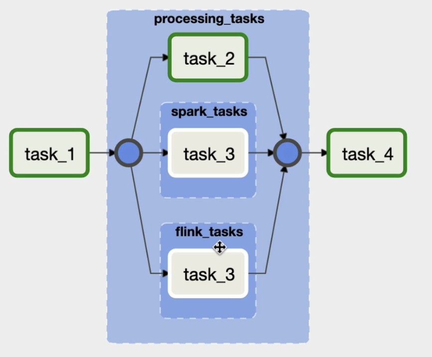

## Introduction
- How to make your DAG cleaner
  - reading file A, B, C ... will have seperate task for each, how can we group thoese repetitive tasks togther and share same functionality in order to make your DAG cleaner
- How to choose one task or another
  - like, the next task will depend on the previous task, if user subscribe, they'll not get email, else they will get an email?
- How to exchange data between tasks?
  - next task will use the file from previous task
## Minimising DAG with SubDAGs
Turn off load_examples in .cfg file to remove all the DAG example on Airflow website

Example for this section(parallel.py): group task2 and task3 into one task by using subDag

``` python
from airflow.operators.subdag import SubDagOperator
from subdags.subdag_parallel_dag import subdag_parallel_dag

processing = SubDagOperator(
  task_id = 'processing_tasks',
  subdag=subdag_parallel_dag('parallel_dag','processing_tasks',default_args)
)

task_1>> processing >>task4
```

in order to do this, create a new folder called subdags, and a new file subdag_parallel_dag.py
- One very important thing here: you create a new dag with a dag id corresponding to the parent dag id with the child id, the default args must be the same as parent and you have to return the dag with the tasks that you want to group together

``` python
from airflow import DAG
from airflow.operator.bash import BashOperator
def subdag_parallel_dag(parent_dag_id, child_dag_id, default_args):
  with DAG(dag_id=f'{parent_dag_id}.{child_dag_id}', default_args) as dag:
    task_2 = BashOperator(
      task_id = 'task_2',
      bash_command='sleep 3'
  )
  
    task_3 = BashOperator(
      task_id = 'task_3',
      bash_command='sleep 3'
  )
  
  return dag
```

SubDAGs are not encouraged for use, three reasons:
- deadlocks: that means you might not be able to execute any more tasks in your instance at some point
- complex
- subdag has its own executer, in that case, with the subject that we have just added, we use the sequential executor by defalt even if in the configuration of airflow we have two local executor. So if you're able to execute multiple tasks in parallel, you won't be able to do taht inside subdag.

## TaskGrousp 
Just need to put the tasks under Taskgroup
``` python
from airflow.utils.task_group import TaskGroup
which TaskGroup('processing_tasks') as processing_tasks:
    task_2 = BashOperator(
      task_id = 'task_2',
      bash_command='sleep 3'
  )
  
    task_3 = BashOperator(
      task_id = 'task_3',
      bash_command='sleep 3'
  )
task_1>> processing_task >>task4
```

Create subgroups under inside group
``` python
from airflow.utils.task_group import TaskGroup
which TaskGroup('processing_tasks') as processing_tasks:
    task_2 = BashOperator(
      task_id = 'task_2',
      bash_command='sleep 3'
  )
    with TaskGroup('spark_tasks') as spark_tasks:
        task_3 = BashOperator(
          task_id = 'task_3',
          bash_command='sleep 3'
      )
    with TaskGroup('flink_tasks') as flink_tasks:
        task_3 = BashOperator(
          task_id = 'task_3',
          bash_command='sleep 3'
      )
      
task_1>> processing_task >>task4
```


## Exchange Data between tasks 
- use external tool: add complexity to date pipeline
- use xcom: cross communication allows to exchange small amount of data. Since we're actually storing data in meta database. So depending on database you use for your instance, you'll have different size limits
  - sqlite: 2Gb
  - postgres: 1Gb
  - mysql: 64KB
- so don't use airflow as a processing framework like Spark or Flink

## Xcom in Practice
xcom_dag.py
``` python
from airflow import DAG
from airflow.operators.bash import BashOperator
from airflow.operators.python import PythonOperator
from airflow.operators.subdag import SubDagOperator
from airflow.utils.task_group import TaskGroup

from random import uniform
from datetime import datetime

default_args = {
    'start_date': datetime(2020, 1, 1)
}

def _training_model(ti):
    accuracy = uniform(0.1, 10.0)
    print(f'model\'s accuracy: {accuracy}')
    ti.xcom_push(key='model_accuracy', value=accuracy)

def _choose_best_model(ti):
    print('choose best model')
    accuracies = ti.xcom_pull(key='model_accuracy', task_ids[
      'processing_tasks.training_model_a',
      'processing_tasks.training_model_b',
      'processing_tasks.traning_meodel_c'])
    print(accuracies)

with DAG('xcom_dag', schedule_interval='@daily', default_args=default_args, catchup=False) as dag:

    downloading_data = BashOperator(
        task_id='downloading_data',
        bash_command='sleep 3',
        do_xcom_push=False
    )

    with TaskGroup('processing_tasks') as processing_tasks:
        training_model_a = PythonOperator(
            task_id='training_model_a',
            python_callable=_training_model
        )

        training_model_b = PythonOperator(
            task_id='training_model_b',
            python_callable=_training_model
        )

        training_model_c = PythonOperator(
            task_id='training_model_c',
            python_callable=_training_model
        )

    choose_model = PythonOperator(
        task_id='task_4',
        python_callable=_choose_best_model
    )

    downloading_data >> processing_tasks >> choose_model
```
## Choosing a specific path in your DAG
BranchPythonOperator: allows you to execute one task or another by returning the task id of task you want to execute

## Executing a task according to a condition
