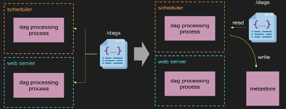

Scheduler High Availability
- You will be able to have multiple schedulers running at the same time so that if one scheduler goes done, Airflow will still be able to schedule tasks. This will improve preferences by reducing tasks to task.

DAG Serialization
- Stateless web server
- Lazy loading of DAGs
- Stateless schedule soon

DAG Versioning
- Provide maintenanc DAGs
- Stroing multiple versions of serialized DAGs
- Graph view show the DAGs associated with that DAGRun

Rest API
- Stable version
- Follows Open API 3.0 specification
- Way more endpoints than today

KEDA Queues
- Queues were expensive(pre allocation)
- With KEDA queues are way much cheaper (scale t 0)
- K8s queues are customizable(worker size, GPU..)

Functional DAGs
- Easy way to convert fuctions to tasks
- Simiplified way of writing DAGs
- Pluggable XCome Storage Engine

Smaller Changes
- Connection IDs must be unique
- python3.5>only
- RBAC UI only
- Impor of operators has changed
